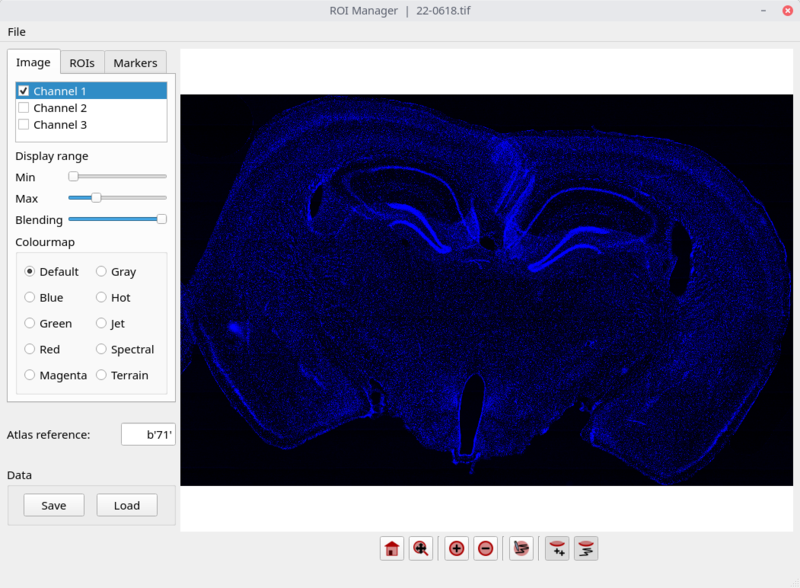
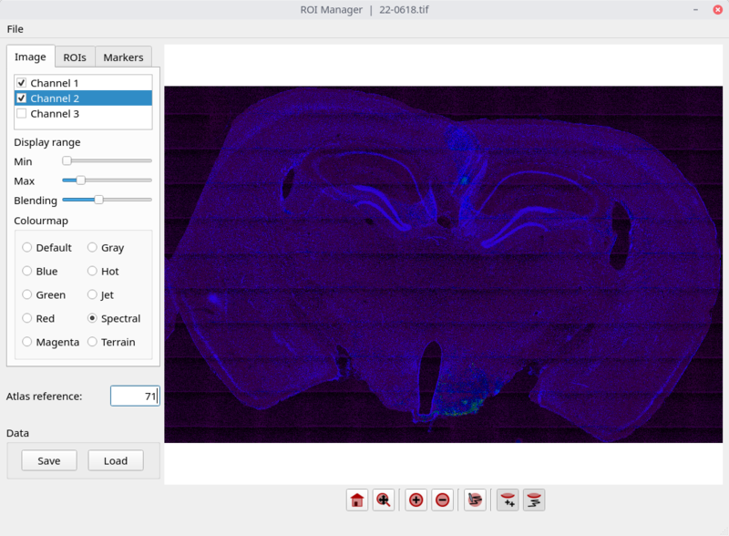
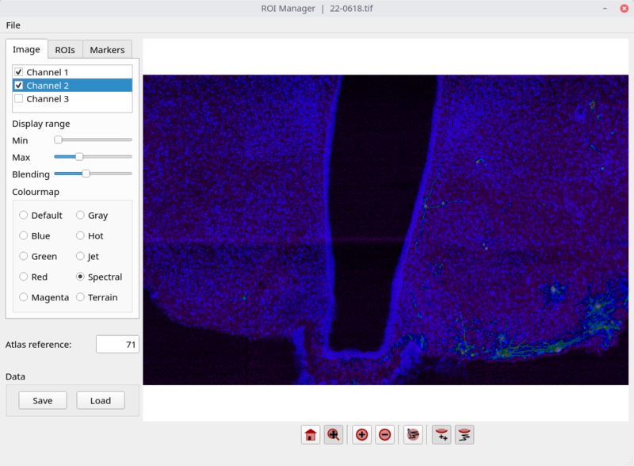
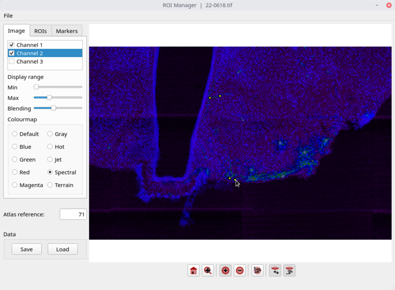
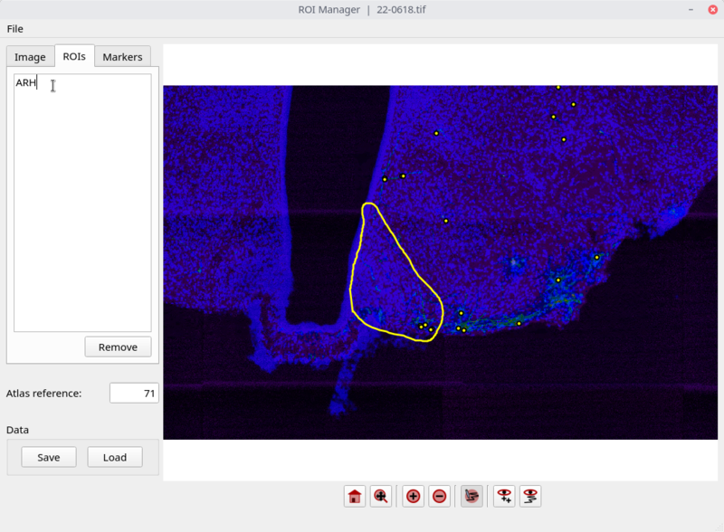
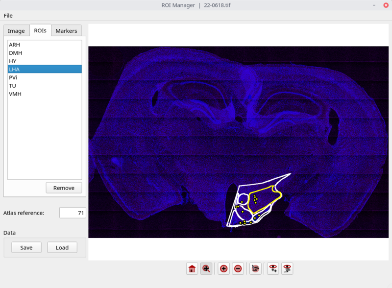

==========
roimanager
==========

Facilitates counting cells in micrographs from brain tissue and sorting
them into different anatomical regions of interest (ROIs).

This package displays an imageJ tiff image and provides tools to
navigate the image, draw and name ROIs, and mark cells. The ROIs and
markers are saved into individual hdf5 files. At a later stage these
files can be read and the counted cells sorted into their respective
ROIs.

The package was originally developed to count projection neurones in
sections of mouse brain, and sort those cells into anatomical regions;
see:

|       González *et al* (2016). Awake dynamics and brain-wide direct inputs of hypothalamic
|       MCH and orexin networks. *Nature Communications* 7:11395 (DOI: 10.1038/ncomms11395).

(\C) 2015-2018 `Antonio González <mailto:antgon@cantab.net>`_

Requirements
============

- `Python 3 (>= 3.6) <https://www.python.org/>`_
- `Numpy (>= 1.13) <http://www.numpy.org>`_
- `PyQt5 (>= 5.10) <https://riverbankcomputing.com/software/pyqt/download5>`_
- `h5py (>= 2.7) <https://www.h5py.org/>`_
- `matplotlib (>= 2.1) <https://matplotlib.org/>`_
- Christoph Gohlke's `tifffile.py 2018.02.10 <https://www.lfd.uci.edu/~gohlke/>`_

How to use it
=============

Mark cells and define ROIs
--------------------------

1. Open a file. Select a channels and change the display range to
improve the view.

2. Select other channels. Control how different layers blend with
**Blending**. Choose a **Colourmap** that highlights features of
interest.

3. Toggle the **Zoom/Scroll** button to zoom in (using the mouse wheel)
and scroll (click-and-drag).

4. Toggle the **Add marker** button and click on the image to add
markers. Remove unwanted markers with the **Remove marker** tool.

5. Use the **Add ROI** tool to draw a ROI

6. A default ROI name will appear on the list of ROIs. Double click on
the name to modify it. Name the ROI using an acronym from the Allen
Brain Atlas.

7. The **Home** button displays the full image. Click **Save** to save
the markers and ROIs in a hdf5 file.

Sort cells into ROIs
--------------------

Links
=====

* The code is licensed under the `GNU General Public License`_.
* The `source code`_ is in GitHub.

.. _`GNU General Public License`: http://www.gnu.org/licenses/gpl.html
.. _`source code`: https://github.com/antgon/roimanager
